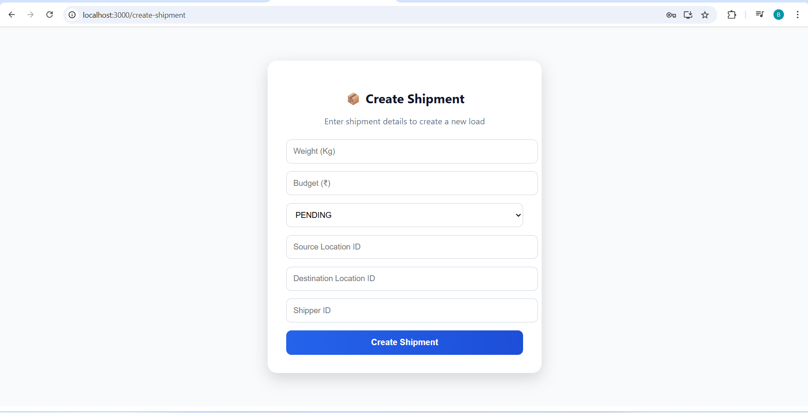
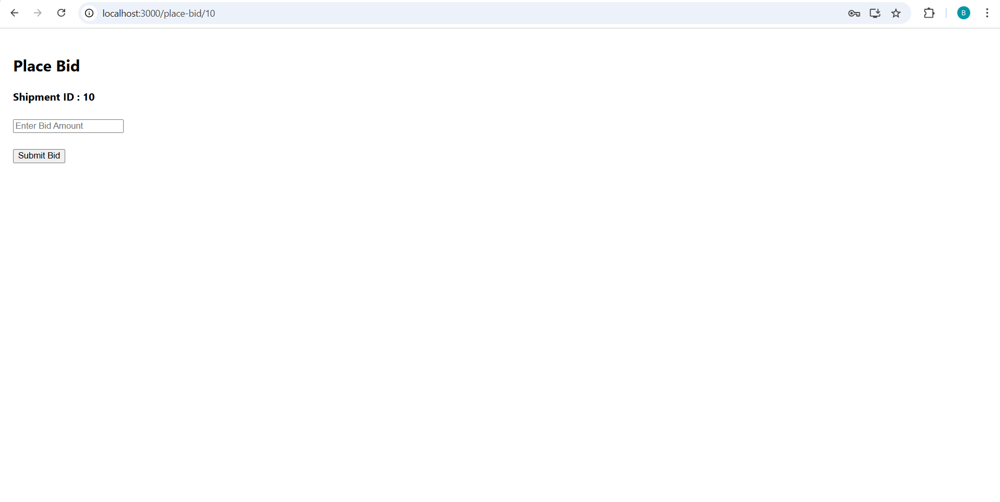
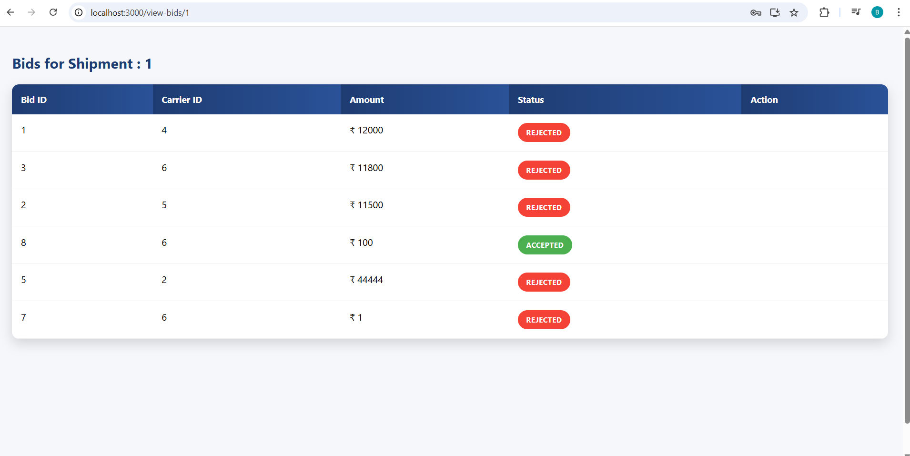
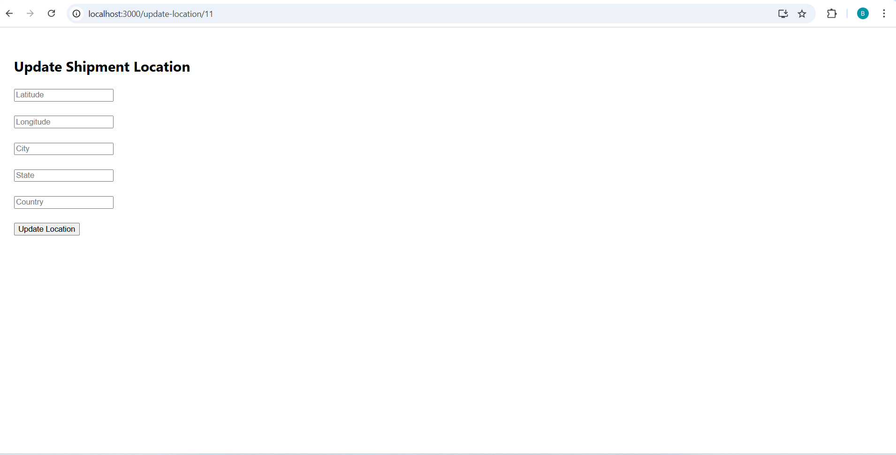

# 🚚 Logistics Marketplace - Shipment Management System

A full-stack **Logistics Marketplace Platform** that connects **Shippers** and **Carriers** through shipment creation, bidding workflow, assignment, and real-time shipment tracking.

The application provides a complete shipment lifecycle:

**Create Shipment → Receive Bids → Accept Carrier → Track Shipment → Deliver Shipment**

---

# 📌 Project Overview

Logistics Marketplace is a web-based platform designed to simplify transportation management.

Shippers can create shipments, manage bids, assign carriers, and track deliveries.

Carriers can view available shipments, place bids, manage assigned shipments, update live locations, and complete deliveries.

---

# ✨ Features

## 🔐 Authentication & Authorization

- JWT based authentication
- Secure login system
- Role-based access control

Roles:

- SHIPPER
- CARRIER

---

## 📦 Shipment Management

### Shipper Features

- Create new shipments
- View shipment dashboard
- View shipment details
- Cancel shipments
- Monitor shipment status

Shipment Status Flow:

PENDING
↓
BIDDING
↓
AWAITING_PICKUP
↓
IN_TRANSIT
↓
DELIVERED

---

## 💰 Bidding System

Carrier workflow:

- View available shipments
- Place bids
- Manage assigned shipments

Shipper workflow:

- View received bids
- Accept carrier bid
- Automatically reject other bids

---

## 🚚 Carrier Dashboard

Carrier can:

- View assigned shipments
- Start shipment pickup
- Update shipment location
- Mark shipment as delivered

---

## 🌍 Real-Time Shipment Tracking

Implemented using:

- WebSocket
- STOMP Protocol
- SockJS
- React Leaflet Maps

Features:

- Live location updates
- Automatic WebSocket reconnect
- Interactive map tracking

---

# 🛠 Tech Stack

## Backend

- Java
- Spring Boot
- Spring Security
- JWT Authentication
- Spring Data JPA
- PostgreSQL
- WebSocket
- STOMP

## Frontend

- React.js
- React Router
- Axios
- Leaflet Maps
- SockJS
- STOMP Client

## Tools

- Git & GitHub
- Postman
- VS Code
- Eclipse

---

# 🏗 Project Structure

logistics-marketplace

│
├── backend
│ ├── controller
│ ├── service
│ ├── repository
│ ├── entity
│ ├── security
│ └── websocket
│
├── frontend
│ ├── pages
│ ├── components
│ ├── services
│ └── styles
│
├── docs
│ └── screenshots
│
└── README.md

---

# 📸 Application Screenshots

## 🔐 Login Page

## 🚚 Shipper Dashboard

## 📦 Create Shipment

## 🚛 Carrier Dashboard

## 📋 Available Shipments

## 💰 Place Bid

## 📑 View Bids

## 📦 Shipment Details

## 🌍 Live Tracking

## 📍 Update Location

---

# 🚀 Running the Application

## Backend Setup

Clone repository:

git clone https://github.com/Swamybusa/logistics-marketplace.git

Open backend project.

Configure PostgreSQL database:

spring.datasource.url=jdbc:postgresql://localhost:5432/logistics
spring.datasource.username=postgres
spring.datasource.password=password

Run Spring Boot application.

Backend runs on:

http://localhost:8080

---

## Frontend Setup

Navigate to React project:

cd logistics-tracking-ui

Install dependencies:

npm install

Start application:

npm start

Frontend runs on:

http://localhost:3000

---

# 🔑 Demo Credentials

## Shipper Login

Email:
shipper@gmail.com

Password:
password

## Carrier Login

Email:
carrier@gmail.com

Password:
password

---

# 📡 Important API Endpoints

## Authentication

POST /auth/login

---

## Shipments

POST /api/shipments

GET /api/shipments

GET /api/shipments/{id}

PUT /api/shipments/{id}/start

PUT /api/shipments/{id}/deliver

---

## Bidding

POST /api/bids

GET /api/bids/shipment/{shipmentId}

PUT /api/bids/{bidId}/accept

---

## Tracking

POST /api/tracking-locations

GET /api/tracking-locations/latest/{shipmentId}

WebSocket:

/topic/shipments/{shipmentId}

---

# 🔮 Future Enhancements

- Payment integration
- Notification system
- Route optimization
- Mobile application
- Advanced analytics dashboard
- Container deployment using Docker

---

# 👨‍💻 Author

**Swamy Busa**

Full Stack Developer  
Java | Spring Boot | React | PostgreSQL

---

⭐ If you like this project, consider giving it a star!